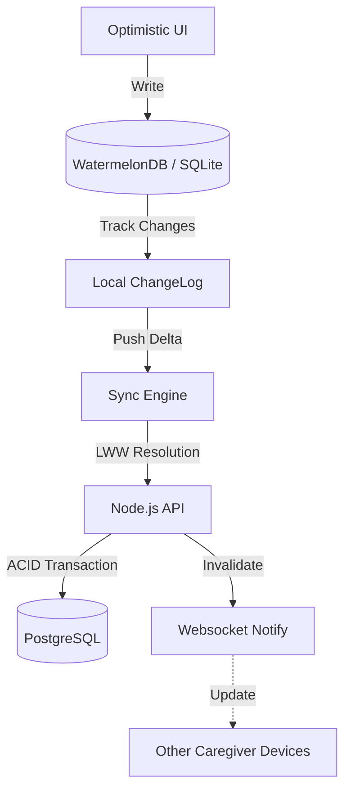

# 專案架構：離線優先的育兒記錄 App (Baby Tracker)

## 1. 專案簡介 (Overview)
這是一個為了我與家人開發的實用工具。核心目標是建立一個「離線優先」的系統，讓家長在收訊不佳的地方（例如家裡的角落或醫院）依然能順暢記錄，並在恢復連網後，能精準地同步多個裝置之間的資料。

---

## 2. 技術設計與實務考量

### A. 網路沒連上時，如何確保資料不會亂掉 (Consistency)
- **問題點**：如果 App 一定要連網才能記奶量，只要收訊不好，使用者體驗就會變得很差。
- **解決方法**：我採用了 **CAP 定理中的 AP 模型**（可用性與分區容忍）。
- **實務做法**：App 永遠允許使用者即時寫入資料到本地資料庫。資料一致性則是透過「最終一致性 (Eventual Consistency)」來達成，等有網路的時候才在背景慢慢對齊。

### B. 兩個人同時記帳，系統聽誰的？ (Conflict Resolution)
- **問題點**：當我跟太太在沒網的地方同時修改了同一筆紀錄，連上網後資料會「打架」。
- **解決方法 (LWW)**：我實作了 **Last-Write-Wins (LWW)** 策略，並搭配資料版本號。
- **亮點**：我設計了一套「欄位級合併 (Column-level Merge)」邏輯。如果太太改了奶量，我改了備註，後端會自動把這兩項改動結合起來，而不是粗暴地互相覆蓋。只有當我們同時修改了「同一個欄位」時，系統才會照著最後寫入的時間來決定成敗。

### C. 只傳送變動的部分，省電又省流量 (Delta Syncing)
- **優化目標**：如果每次同步都要上傳整份資料庫，對手機電量跟流量都是負擔。
- **做法**：我設計了 **差異化同步 (Delta Sync)**。
    - **原理**：App 會紀錄最後一次成功同步的時間戳記 (由伺服器發放)。下次連線時，只會詢問伺服器在這段時間之後發生的「變動量」。
    - **斷點續傳**：我將同步封裝成一個個 Patch（補丁）。即使網路在同步到一半時斷掉，下次也會從斷掉的地方繼續，不會重頭再來。同時，透過後端的 **Deduplication Middleware**，確保即使重複發送請求也不會產生重複紀錄。

---

## 3. Distributed Data Flow

---

## 4. Technical Trade-offs (Interview Ready)

| Option | Decision | Rationale |
| :--- | :--- | :--- |
| **Strong Consistency (2PC)** | **Eventual Consistency** | 2PC (Two-Phase Commit) would cause the app to hang or fail whenever the baby's room has weak Wi-Fi. AP is the only viable choice for mobile UX. |
| **Pessimistic Locking** | **Optimistic Concurrency Control** | Locking a "diaper change" record for 10 minutes while someone is offline is impractical. Optimistic versioning handles the 99.9% of non-conflicting cases gracefully. |
| **WebSockets for All** | **REST for Sync + WS for Signaling** | WS is expensive to maintain for long idle mobile apps. REST is more robust for large payload syncs, using WS only to "nudge" other devices to pull. |
