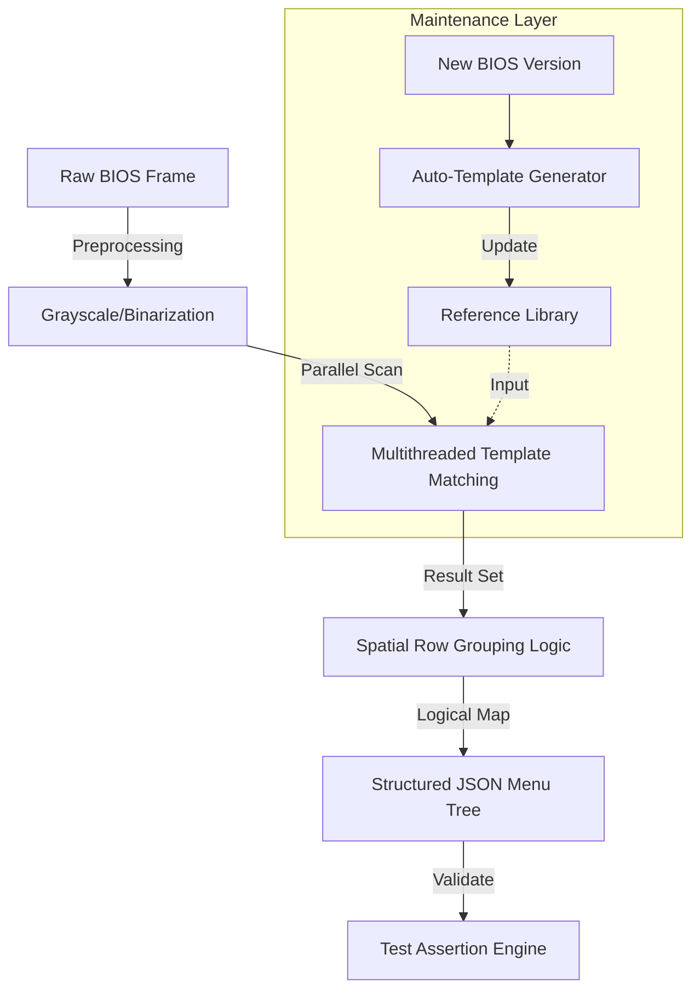

# 專案架構：Deterministic BIOS OCR 辨識引擎

## 1. 專案簡介 (Overview)
這是一個專為 BIOS/UEFI 畫面開發的高精準度視覺辨識工具。它的目標是達到 100% 的座標準確度，並且在毫秒等級內完成辨識，讓自動化測試能像真人操作一樣精準地找到選單位置。

---

## 2. 技術設計與實務考量

### A. 為什麼我們不跟風用 AI / 深度學習？
- **背景考量**：現在主流是 Tesseract 或深度學習模型，但它們在 BIOS 那種非標準、畫質差的像素字體上，辨識率只有 85% 左右，且容易產生「幻覺」誤判。
- **我的決定**：我決定反其道而行，採用 **OpenCV 模板匹配 (Template Matching)**。
- **為什麼？**：
    - **精準度**：這是「決定性 (Deterministic)」的算法，不會有 AI 模型那種機率性的誤判。
    - **效能**：CPU 運算不到 10 毫秒就完成，不需要昂貴的 GPU。
    - **座標定位**：它能直接給你精確的像素座標，這對自動化「點擊特定按鈕」的功能非常關鍵。

### B. 如何處理螢幕上密密麻麻的文字佈局 (Spatial Grouping)
- **挑戰**：OpenCV 雖然找得到字，但它不知道這些字之間的邏輯關係。
- **解決方法**：我寫了一套基於 **Sweep-line (掃描線)** 原理的邏輯，並且用多執行緒加速。系統會自動把偵測到的方塊，照著 Y 軸的鄰近程度組成「行」，再照 X 軸組成「列」。這讓原本破碎的辨識結果，變成了有組織的 JSON 選單樹狀圖。

### C. 自動模板生成器 (Auto-Template Generator)
- **維護痛點**：傳統 OpenCV 最怕 UI 變動，一變就要重新切圖。
- **防呆與自動化**：我開發了一個腳本，只要跑一次「標準流程」，它就會自動把新的 UI 截圖並索引到庫裡。這樣即使硬體改版，我也只要花 5 分鐘跑一下腳本就能完成更新，大幅降低了維護成本。

---

---

## 3. Data Processing Pipeline

---

## 4. Technical Trade-offs (Interview Ready)

| Option | Decision | Rationale |
| :--- | :--- | :--- |
| **Tesseract/DL** | **OpenCV Template** | Higher precision for fixed-font bitmapped UIs and much lower computational overhead. |
| **Row-based vs Grid-based** | **Dynamic Row Grouping** | BIOS menus vary in line height across versions; a rigid grid would break, but dynamic grouping adapts to vertical variance. |
| **C++ vs Python** | **Python (with C-extensions)** | Leveraging OpenCV's C++ core via Python wrappers allowed for rapid iteration on the grouping logic without sacrificing scan performance. |
