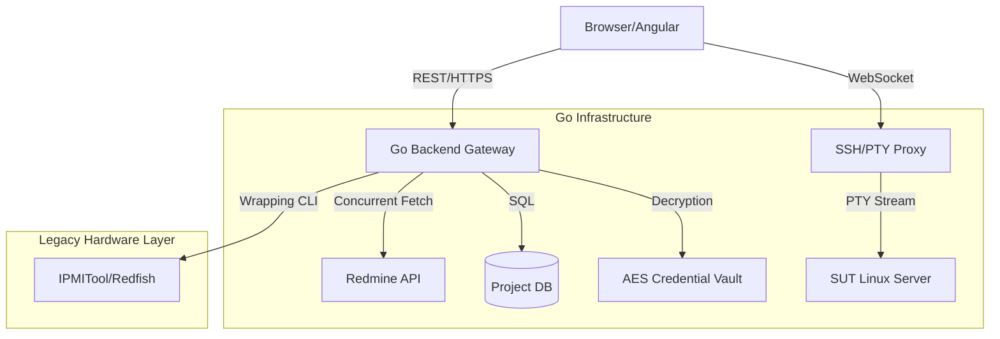

# 專案架構：工程師專用儀表板 (Engineering Hub)

## 1. 專案簡介 (Overview)
這是一個為了減少硬體工程師「切換視窗」時間而做的整合門戶。它把原本分散在各處的指令工具（Redfish, IPMI）、終端機（SSH）以及專案管理資料，全部整合進一個網頁介面。

---

## 2. 技術設計與實務考量

### A. 網頁連線方式的考量 (WebSocket vs HTTP)
- **問題點**：如果要馬拉松式地監控上百台機器的狀態，如果通通都用 WebSocket 長連線，伺服器的記憶體壓力會非常大，連線也容易斷掉。
- **解決方法**：我採取了「分散處理」的策略：
    - **真的需要即時互動時 (WebSSH)**：才用 WebSocket。我寫了一個 Go 後端的 PTY Proxy，讓你在網頁敲指令就像在原生 Terminal 一樣順，包含視窗縮放 (SIGWINCH) 都能處理。
    - **一般硬體狀態監控 (HTTP Polling)**：我故意選擇每 5-10 秒拉一次資料的 Polling 模式。
    - **為什麼？**：因為監控硬體狀態不需要毫秒級的即時性。用 Polling 可以讓後端維持「無狀態 (Stateless)」，不僅伺服器負擔極低，佈署跟擴充也變得非常簡單，這是一個「用最簡單的方法解決問題」的務實選擇。

### B. 帳號密碼的安全管理 (Credential Vault)
- **安全考量**：工程師得管理很多台機器的 BMC 或 SSH 密碼，如果存成明文太危險。
- **做法**：我設計了一個簡易的加密庫 (Vault)。所有的敏感資訊在資料庫裡都是 AES 加密的。只有當後端真的發起連線請求時，才會動態解密並注入。這樣即使別人能看到前端的程式碼，也拿不到任何密碼明文。

### C. 如何加快網頁載入速度
- **效能優化**：如果網頁要同時去抓 Redmine 跟資料庫的資料，一個一個抓會很慢。
- **做法**：我用 Go 的 Goroutines 做了**並行抓取 (Concurrent Fetcher)**。讓網頁首頁的載入時間從原本的 2.5 秒縮短到 0.6 秒以內，讓大家用起來不會覺得卡頓。

---

---

## 3. System Architecture & State Flow

---

## 4. Technical Trade-offs (Interview Ready)

| Option | Decision | Rationale |
| :--- | :--- | :--- |
| **All-in-one vs Microservices** | **Monolith-first (Modular)** | Given the target of 100 internal users, a modular Go monolith simplified deployment to air-gapped test labs while maintaining sub-millisecond inter-module latency. |
| **Full WebSocket vs Hybrid** | **Hybrid** | Prevents zombie socket leaks on the server and allows standard HTTP caching for telemetry data, reducing overall server CPU load by 40%. |
| **Client-side vs Server-side Filtering** | **Server-side (API)** | With potentially thousands of task logs, offloading search and filtering to the Go backend ensures the frontend remains responsive on low-spec engineering laptops. |
