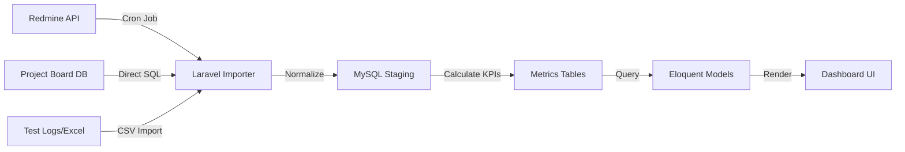

# Issue Tracking Analytics Dashboard

## Project Overview
**Stack**: PHP (Laravel), MySQL, JQuery/Bootstrap (Frontend)
**Users**: Department Heads, Project Managers, Team Leads
**Goal**: Aggregate issue tracking data from disparate systems to visualize "Pending Time" and "Team Health".

---

## 2. System Architecture

### Data Flow (ETL Pipeline)
The system acts as a centralized Data Warehouse for project management metrics.

### Key Components

#### A. Data Aggregator (The "Harvester")
- **Frequency**: Runs nightly via Laravel Scheduler (Cron).
- **Challenge**: Mapping different "Status" definitions across systems.
  - Redmine: `New`, `Assigned`, `Feedback`, `Resolved`
  - Project Board: `To Do`, `In Progress`, `Done`
- **Solution**: Created a `StatusNormalizationService` that maps all external states to 3 internal buckets: `Open`, `Pending (Unhealthy)`, `Closed`.

#### B. The "Unhealthy" Algorithm
How do we define an "Unhealthy" issue?
1.  **Stagnation**: Last updated > 7 days ago.
2.  **Ping Pong**: Assigned to > 3 different people in 24 hours (bouncing ticket).
3.  **Aging**: Open for > 30 days without "Feedback" state.

#### C. Hierarchical Reporting
- **Department View**: High-level traffic light charts (Green/Yellow/Red) for overall health.
- **Manager View**: Breakdown by project.
- **Team Lead View**: Detailed list of specific "Unhealthy" tickets assigned to their members.

---

## 3. Database Schema Design
Moving away from querying APIs in real-time (too slow), I designed a local schema optimized for analytical queries (OLAP-lite).

- `snapshot_issues`: Stores the state of every issue for every day. Allows "Time Travel" reporting (e.g., "Show me the trend of unhealthy tickets over the last Q3").
- `team_metrics`: Pre-calculated aggregations (Count, Avg Pending Time) to speed up dashboard loading.

---

## 4. Technical Challenges

### Challenge: Redmine API Rate Limiting
- **Issue**: Fetching 5000+ issues triggered API bans.
- **Fix**: Implemented `Cursor Pagination` and `exponential backoff` jobs in the Laravel Queue. Only fetched *modified* tickets (`updated_on > last_sync`) aka Incremental Sync.

### Challenge: Excel Data Ingestion
- **Issue**: Some legacy teams tracked bugs in Excel.
- **Fix**: Built a robust Excel Import module using `Maatwebsite/Laravel-Excel` that validates columns and rejects malformed rows before ingestion.
