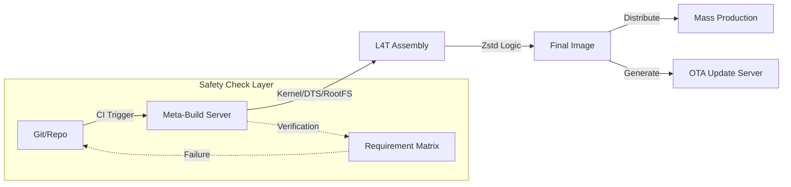

# Jetson BSP Development & Automation Architecture

## 1. Core Logic & Workflow (Based on `build.sh`)
The build process is deeply automated and "Offline First", removing the need for a live Jetson device during the build phase.

### A. Environment & Pre-checks
*   **Modular Design**: Uses library scripts (`lib_logging.sh`, `lib_env.sh`, `lib_precheck.sh`) for maintainability.
*   **Safety**: Enforces `set -euo pipefail` to fail fast on errors (Critical for CI/CD).
*   **Variables**:
    *   `BOARD_CONFIG_NAME`: `smci-orin-nano-hdmi-nvme` (Custom Config)
    *   `BSP_VERSION`: `R36-4` (JetPack 6.x)

### B. Artifact Extraction
*   Extracts `L4T_RELEASE_PACKAGE`, `SAMPLE_FS_PACKAGE` (RootFS), `KERNEL_SOURCE`, `OOT_MODULE_SOURCE`.
*   **Binaries**: Applies NVIDIA L4T binaries and creates a default user (`l4t_create_default_user.sh`).
*   **Toolchain**: Sets up the AArch64 cross-compilation toolchain on the fly.

# 專案架構：Jetson Orin BSP 與自動化部署優化

## 1. 專案簡介 (Overview)
這個專案的重點是把原本很零散、容易出錯的 Jetson 韌體編譯與刷機流程，轉化成一套穩定的自動化管線。目標是支援多種硬體版本 (SKU)，並確保產線在大量生產時，刷機速度能達到最快。

---

## 2. 技術重點與實務考量

### A. 解決工廠端的效率問題 (Mass Production)
- **問題點**：在工廠，如果一台一台用 USB 刷機太慢了，會造成生產瓶頸。
- **改進方法**：我優化了 **MassFlash (MFI)** 流程。現在一台電腦可以同時並行刷 5 塊以上的板子。
- **防呆機制**：我在刷機前加了一層檢查，會自動比對機器的 ID 跟硬體規格，避免因為拿錯版本而導致機器變廢鐵 (Brick)。

### B. 為什麼要把演算法換成 Zstd？
- **背景**：原本系統是用舊的 Gzip 壓縮，雖然穩但體積大。
- **實務抉擇**：我主動推動改用 **Zstd** 演算法。
    - **亮點**：這讓韌體體積直接縮減了 30%。對工廠來說，每天要下載上百次韌體，這代表每天能省下好幾個小時的等待時間，出貨速度 (UPH) 明顯提升。
- **無痛升級策略**：為了不讓產線同仁覺得麻煩，我把 Zstd 的複雜邏輯都包在原本的腳本裡。對他們來說，敲的指令沒變，但「感覺速度變快了」。

### C. 防止編譯出錯的自動化檢查 (Safety Checks)
- **問題點**：嵌入式系統編譯時，如果少勾了一個驅動程式，編譯雖然會成功，但機器跑起來會黑屏，除錯非常痛苦。
- **解決方法**：我在編譯階段加了一個自動化比對。系統會掃描最終的 Config，如果發現 PCIe 或 NVMe 等關鍵驅動沒被啟用，會立刻報錯中斷並秀出差異點。這讓我們不用等到機器啟動失敗才去抓 Bug。

---

---

## 3. Deployment & Release Flow

---

## 4. Technical Trade-offs (Interview Ready)

| Option | Decision | Rationale |
| :--- | :--- | :--- |
| **Gzip vs Zstd** | **Zstd** | Higher compression ratio and 2x faster decompression on target, directly boosting UPH (Units Per Hour) in manufacturing. |
| **Binary Patch vs Full OTA** | **Full OTA (Selective)** | While binary patches are smaller, Full OTA (with partition awareness) is more resilient against corrupted power-cycling during field updates. |
| **Scripting vs Buildroot** | **Enhanced Scripting** | Given NVIDIA's proprietary L4T structure, custom wrappers allowed for finer control over the complex `initrd` and bootloader capsule generation than standard Buildroot. |
