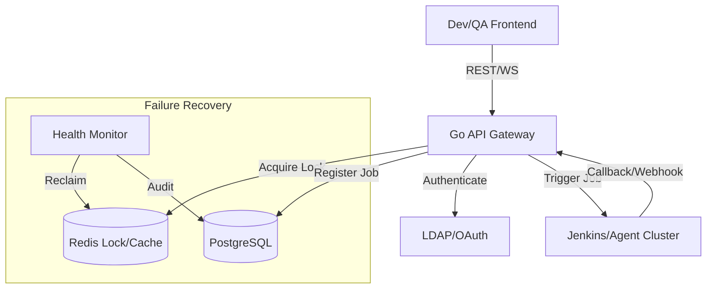

# 專案架構：NVSSVT 自動化測試平台

## 1. 專案簡介 (Overview)
NVSSVT 是一個為了整合各種分散的硬體測試工具而開發的排程平台。它的核心目的是讓原本得靠手動下指令的測試流程，變成可以自動化、且多人同時使用的網頁服務，並將測試結果直接與 CI/CD 串接。

---

## 2. 技術設計與解決方案

### A. 任務排隊與伺服器資源管理 (Concurrency)
- **問題點**：當 100 個工程師同時想測機器，但實驗室的實體機只有 50 台時，如果沒有管理好，機器會被搶成一團，導致測試失敗。
- **解決方法**：我把 **後端 (API/Control Plane)** 跟 **執行端 (Jenkins/Agent)** 拆開。
- **機器鎖機制**：我用 Redis 做了一個「機器領用」的機制。每一台機器都有唯一的 ID，當某個測試任務啟動時，會先去 Redis 拿這台機器的「鑰匙」，測試完才放回去。這樣能確保同一時間，機器不會被兩個人重複操作。

### B. 如何處理當機與任務卡死 (Self-Healing)
- **問題點**：硬體測試常會遇到斷網或 Agent 突然掛掉，如果剛好機器還被鎖著，那台機器就永遠被卡死（Zombie Job）了。
- **解決方法**：
    - **會自動過期的鎖 (Lease/TTL)**：Redis 的鎖都有設逾時時間。
    - **心跳檢查 (Heartbeat)**：執行端會定期回傳「我還活著」的信息。如果 Agent 真的掛了，鎖會自動過期釋放，系統也會自動發現並把這台機器重新排回可用清單。
    - **防止重複操作 (Idempotency)**：每個測試任務都有唯一的 ID。即使因為網路問題導致 API 被重複呼叫，系統也會發現這單子已經接過了，不會重複去對硬體下指令，避免把機器跳掉。

### C. 就算伺服器重啟也不會斷線的設計 (Stateless)
- **狀態卸載**：我把所有「誰在測什麼、目前的進度」等資料都丟到資料庫 (PostgreSQL) 跟 Redis。
- **好處**：這樣後端伺服器即使要升級改版、需要重啟，大家正在跑的測試也不會中斷，重啟後再去 DB 抓資料繼續跑追蹤就好了。

---

---

## 3. Data Flow



---

## 4. Technical Trade-offs (Interview Ready)

| Option | Decision | Rationale |
| :--- | :--- | :--- |
| **Sync vs Async** | **Asynchronous** | Hardware tasks take 30+ mins. Synchronous blocking would exhaust server resources and timeout. |
| **Webhook vs Polling** | **Hybrid (Polling with Webhook optimization)** | Webhooks are faster but unreliable if the portal reboots. Periodic polling ensures 100% state accuracy (Eventual Consistency). |
| **File DB vs Central DB** | **Central (Postgres)** | Multi-user concurrency requires ACID transactions to prevent data corruption in machine status records. |

---

## 5. Key Features & Implementation

### 1. Unified Submission Interface
**Problem**: NVSSVT CLI has 50+ flags. Testers often forgot `--config` or used wrong paths.
**Solution**:
- UI provides dropdowns for valid options only.
- Validation logic in frontend prevents submitting conflicting parameters.
- Backend constructs the canonical command: 
  ```bash
  nvssvt-client -c /data/config/golden_config.json -t [TestPlan] --log /data/logs/[ID]
  ```

### 2. Admin Configuration Management
**Problem**: Distributed teams used different versions of the `validation_rules.json`, leading to "it works on my machine" issues.
**Solution**:
- **Single Source of Truth**: The Portal hosts the master config.
- **Hot Update**: Admins upload a new JSON config via UI. The backend immediately applies it to all new jobs. No manual file copying required on tester laptops.

### 3. Real-Time Monitoring
- **Implementation**:
  - Backend spawns CLI process with `os/exec`.
  - Captures `stdout/stderr` pipes.
  - Broadcasts output via **WebSocket** or Server-Sent Events (SSE) to the specific user's browser.
### 3. Remote Execution & Jenkins Integration
- **Flow**: Portal does NOT run tests locally. It acts as a control plane.
- **Trigger**: Backend sends a payload to Jenkins (via its REST API) containing Test Plan, SUT IP, and Config details.
- **Why?**: Leverage existing Jenkins scalable worker nodes (NVSSVT Hosts) located physically near the SUTs.

### 4. Open API Architecture
- **Design**: API-First approach. The Vue frontend is just one consumer.
- **Integration**: Other internal tools (e.g., Firmware Build Service) can auto-submit validation jobs post-build via:
  ```http
  POST /api/v1/submit
  { "sut_ip": "10.0.1.5", "test_plan": "L1_Basic" }
  ```

---

## Technical Challenges & Solutions

### Challenge 1: Long-Running Process Management
**Issue**: NVSSVT tests can take hours. HTTP requests timeout after seconds.
**Solution**:
- **Asynchronous Architecture**: The API returns `202 Accepted` and a `Job ID` immediately.
- **Goroutines**: The actual test runs in a managed Goroutine.
- **State Persistence**: Job status (Running/Passed/Failed) is tracked in a thread-safe map or lightweight DB (SQLite/BoltDB).

### Challenge 2: Tool Versioning
**Issue**: Different projects require different NVSSVT versions.
**Solution**:
- **Docker Volume Strategy**: Tools are stored in `/mnt/tools/[version]`.
- UI allows selecting "Tool Version". Backend sets `$PATH` or invokes the specific binary path dynamically.

---

## Deployment
```yaml
version: '3'
services:
  nvssvt-portal:
    image: nvssvt-portal:latest
    ports:
      - "8080:80"
    volumes:
      - ./logs:/app/logs
      - ./config:/app/config
      - ./tools:/app/tools
    restart: always
```

---

## Future Roadmap
- LDAP/SSO Integration for user tracking.
- Scheduler for nightly regression runs.
- Integration with JIRA to auto-file bugs on failure.
